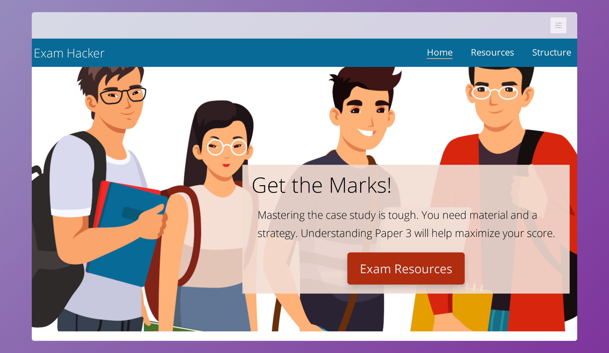

# About Me
Coding has been a hobby of mine and I want to do it professionally. I am switching careers from education to programming.

## Recently
I have just completed the intensive Full Stack Developer Program at Code Institute and am looking forward to starting my career in tech. I expect the final marks in a few weeks time.

### Current Project(s)
I am currently taking a deeper dive into the technology I was exposed to during my training at Code Institute. In particular, I am looking into the more advanced features of Django including authorization and channels as well as the more advanced concepts of JavaScript and sharing what I have learned on [Codu](https://www.codu.co/). 

### Past Projects
+ A website in pure HTML and CSS to help IB Computer Science students master the Paper 3 exam.
+ A Rock, Paper, Scissors, Lizard, Spock! game in JavaScript and HTML
+ A thermodynamic calculator written in Python that allows you to query a dataset to calculate the enthalpy, free energy, and entropy change for chemical reaction.
+ A book blogging site using Django for readers to see and comment upon what other book lovers are reading.
+ Nonna's Kitchen - My capstone project for Code Institute using React as a front end and Django REST Api as the backend. The site will offer those who love food as much as I do a chance to browse through and share their favorite recipes and memories.

|[Exam Hacker](https://tony-albanese.github.io/ci-project-1/)|[Rock Paper Scissors Lizard Spock](https://tony-albanese.github.io/ci-project-2/game.html)|[Thermodynamic Calculator](https://tony-albanese.github.io/chem-calc-landing-page/)|[BookShelf](https://ci-project-4-bookshelf.herokuapp.com/accounts/login/)|[Nonna's Kitchen](https://github.com/tony-albanese/nonnas-kitchen) |
|---|---|---|---|---|
|  | |  |||
|  |  || |	 	  |

## Articles
+ [Using Django Channels and Channel Layers](https://www.codu.co/articles/using-django-channels-and-channel-layers-b9ox6wvd)
+ [Writing Custom HTML Elements](https://www.codu.co/articles/writing-custom-html-elements-mxwqnlgc)
+ [Using Django Q Objects for Complex Searches](https://www.codu.co/articles/using-q-objects-for-complex-searches-6vk9rl78).

## Other Tech
I love anything having to do with coding and some of the other technologies I enjoy working with are:
+ Android - I love Android and will get back to writing Android apps as soon as I can.
+ Flutter - What a cool framework. One codebase for Windows, Linux, iOS, Android, and web - what more could you want?
+ Python - The language that can do almost anything. Anyone who loves science and coding as much as I do just loves Python. It is the language for data analysis.

## Not Just Coding...
I love my computer. I really do. However, when I am not sitting in front of it I like spending my time doing things that enrich my life.

+ Reading - Science and math top the list but when I am in the mood for fiction (which is a lot), I love mysteries and historical fiction.
+ Cooking - My parents were Italian immigrants and you better believe food was (and is) an important part of my life. Nothing makes me happier than spending some time in front of the stove preparing something tasty.
+ The three Bs - Bach, Beethoven, Brahms - Studying their music is an endless source of satisfaction

<!--
**tony-albanese/tony-albanese** is a ✨ _special_ ✨ repository because its `README.md` (this file) appears on your GitHub profile.

Here are some ideas to get you started:

- 🔭 I’m currently working on ...
- 🌱 I’m currently learning ...
- 👯 I’m looking to collaborate on ...
- 🤔 I’m looking for help with ...
- 💬 Ask me about ...
- 📫 How to reach me: ...
- 😄 Pronouns: ...
- ⚡ Fun fact: ...
-->
